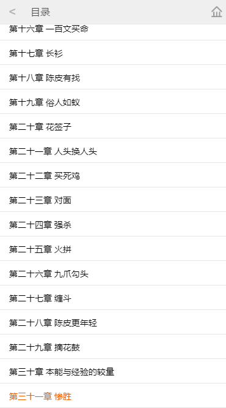

# BookCity
> 项目介绍

```
读书在小米 创作无极限 —— 这个口号一直是起点众多玄幻、魔幻、武侠、军文小说作者的创作目标，严谨的写作态度，锲而不舍的求新求变，与书友的直接沟通交流修改，从而起点中文网拥有国内很多具有一流水平的原创作品，使书友得以在第一时间阅读到作者连载的好书佳作。
```
> 技术栈

```
gulp + require + handlebars + ES6/7 + ajax + sass + flex + canvas
```

> 项目运行

```
npm install --save-dev
npm run dev
```

```
> 项目结构

|——mock
|     |——detail
|     |     |---352876.json         //老九门数据
|     |——index
|     |     |---home.json           //首页数据
|     |     |---recommend1.json     //加载更多
|     |     |---recommend2.json     //加载更多
|     |     |---recommend3.json     //加载更多
|     |——login
|     |     |---user.json           //用户数据
|     |——menu
|     |     |---chapter-list.json   //老九门目录
|     |——read
|     |     |---data1.json          //第一章
|     |     |---data2.json          //第二章
|     |     |---data3.json          //第三章
|     |     |---data4.json          //第四章
|     |——search
|     |     |---search.json         //搜索结果数据
|     |     |---searchKey.json      //搜索关键字
|     |——index.js       //数据接口
|——src
|     |——css
|     |     |——lib
|     |     |       |---swiper-4.3.2.min.css       //获取地址栏参数
|     |     |---common.css    
|     |     |---detail.css
|     |     |---index.css
|     |     |---login.css
|     |     |---menu.css
|     |     |---read.css
|     |     |---search.css
|     |——page
|     |     |---detail.html         //详情页
|     |     |---login.html          //登录也
|     |     |---menu.html        //目录页
|     |     |---read.html           //阅读页
|     |     |---search.html         //搜索页
|     |——js
|     |     |——lib
|     |     |       |---bscroll.min.js
|     |     |       |---flexible.js
|     |     |       |---handlebars-v4.0.11.js
|     |     |       |---jquery-2.1.1.min.js
|     |     |       |---jquery.base64.js        //base64 解码
|     |     |       |---jquery.lazyload.js      //懒加载
|     |     |       |---require.js
|     |     |       |---require.text.js
|     |     |       |---swiper-4.2.2.min.js
|     |     |——common
|     |     |       |---getUrl.js       //获取地址栏参数
|     |     |       |---temp.js         //handlebars 公共编译模板
|     |     |——detail
|     |     |       |---index.js        //详情页
|     |     |——index
|     |     |       |---index.js        //首页
|     |     |——menu
|     |     |       |---index.js        //目录页
|     |     |——login
|     |     |       |---index.js        //登录页
|     |     |——read
|     |     |       |---index.js        //阅读页
|     |     |——search
|     |     |       |---index.js        //搜索页
|     |     |——main.js                  //require配置文件
|     |——template
|     |     |——details
|     |     |       |---detail.html     //详情页模板
|     |     |——index
|     |     |       |---index-banner-nav.html       //轮播导航
|     |     |       |---index-girlsfavorite.html    //男生女生最爱公共模板
|     |     |       |---index-recommend.html        //重磅推荐
|     |     |       |---index-special.html          //专题
|     |     |       |---index-weekhot.html          //本周最火
|     |     |——reader
|     |     |       |---reader.html     //阅读页模板
|     |     |——search
|     |     |       |---search-dl.html  //搜索页
|     |     |       |---search.html
|     |——index.html     //首页
|——gulpfile.js
```

> 部分截图



